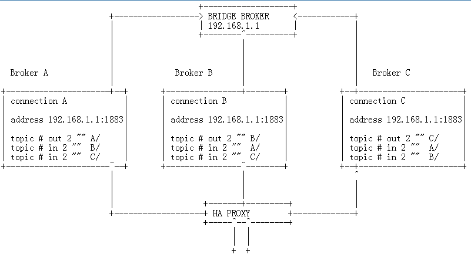
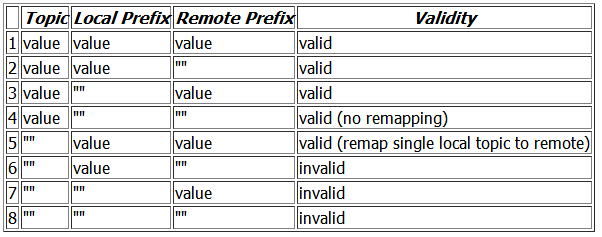

## 单机部署
[windows环境下mosquitto环境搭建与mqtt测试](http://blog.csdn.net/pgpanda/article/details/51800865)

[Mosquitto linux安装](http://blog.csdn.net/xukai871105/article/details/39252653)

启动时，会有很多报错，需要安装一下：

~~~linux
yum install gcc gcc-c++
yum install openssl-devel
yum install c-ares-devel
yum install libuuid-devel
yum install wget
yum install cmake
yum install build-essential python quilt devscripts python-setuptools python3
~~~

参考：[CentOS 安装Mosquitto及测试](http://blog.163.com/allegro_tyc/blog/static/33743768201667101816858/)

## 集群搭建

[Mosquitto搭建Android推送服务（三）Mosquitto集群搭建](http://www.cnblogs.com/yinyi521/p/6087215.html)，这是前辈写的，亲测可以。

## 集群架构

- 在bridge broker配置集群，通过该节点实现broker A、B、C的message互通。
- **不足：** bridge broker只能是单点，不具有HA。不过在mosquitto.conf中将cleansession设为false时，当bridge broker宕机重启后，之前的消息还是可以同步。
- broker A、B、C可以通过HA proxy或者lb实现分布式。

## Mosquitto.conf的topic配置

>topic pattern [[[ out | in | both ] qos-level] local-prefix remote-prefix]

>Define a topic pattern to be shared between the two brokers. Any topics matching the pattern (which may include wildcards) are shared. The second parameter defines the direction that the messages will be shared in, so it is possible to import messages from a remote broker using in, export messages to a remote broker using out or share messages in both directions. If this parameter is not defined, the default of out is used. The QoS level defines the publish/subscribe QoS level used for this topic and defaults to 0.

>The local-prefix and remote-prefix options allow topics to be remapped when publishing to and receiving from remote brokers. This allows a topic tree from the local broker to be inserted into the topic tree of the remote broker at an appropriate place.

>For incoming topics, the bridge will prepend the pattern with the remote prefix and subscribe to the resulting topic on the remote broker. When a matching incoming message is received, the remote prefix will be removed from the topic and then the local prefix added.

>For outgoing topics, the bridge will prepend the pattern with the local prefix and subscribe to the resulting topic on the local broker. When an outgoing message is processed, the local prefix will be removed from the topic then the remote prefix added.

>When using topic mapping, an empty prefix can be defined using the place marker "". Using the empty marker for the topic itself is also valid. The table below defines what combination of empty or value is valid.

>

>topic # both 2 local/topic/ remote/topic/

## qos-level
- 0: The broker/client will deliver the message once, with no confirmation.“至多一次”，消息发布完全依赖底层 TCP/IP 网络。会发生消息丢失或重复。这一级别可用于如下情况，环境传感器数据，丢失一次读记录无所谓，因为不久后还会有第二次发送。

- 1: The broker/client will deliver the message at least once, with confirmation required.“至少一次”，确保消息到达，但消息重复可能会发生。

- 2: The broker/client will deliver the message exactly once by using a four step handshake.“只有一次”，确保消息到达一次。这一级别可用于如下情况，在计费系统中，消息重复或丢失会导致不正确的结果。
